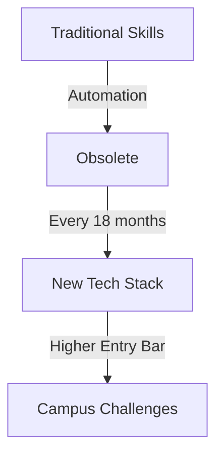
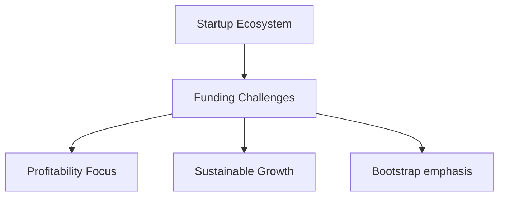
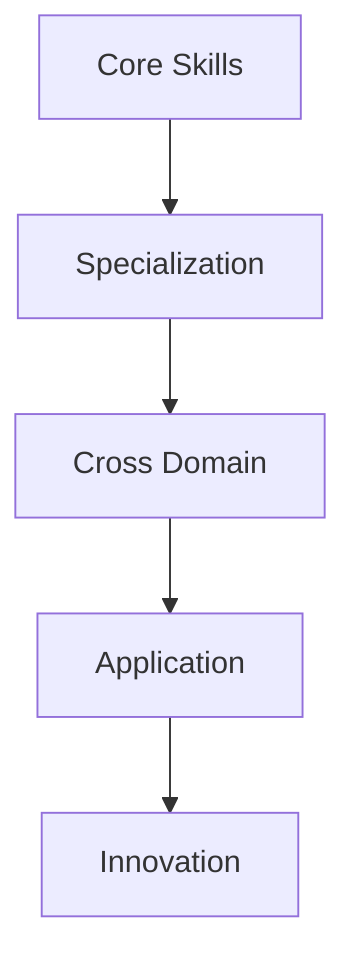
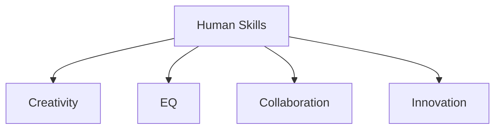

---
# You can also start simply with 'default'
theme: seriph
# random image from a curated Unsplash collection by Anthony
# like them? see https://unsplash.com/collections/94734566/slidev
background: https://cover.sli.dev
# some information about your slides (markdown enabled)
title: Welcome to Slidev
info: |
  ## Slidev Starter Template
  Presentation slides for developers.

  Learn more at [Sli.dev](https://sli.dev)
# apply unocss classes to the current slide
class: text-center
# https://sli.dev/features/drawing
drawings:
  persist: false
# slide transition: https://sli.dev/guide/animations.html#slide-transitions
transition: slide-left
# enable MDC Syntax: https://sli.dev/features/mdc
mdc: true
---

# Wiki-What to AI-aha
Navigating the Tech Evolution

---
layout: section
---

# The Problem Statement
"Information is negative, knowledge is cheap"

---
layout: center
---
<Youtube id="6vMO3XmNXe4" width="854" height="480" />

---
layout: image
image: /typewriter.webp
backgroundSize: 20em 80%
---

# The Hiring Paradox

---
layout: two-cols-header
---
# Campus Reality 2024

::left::

- Entry roles automated by AI/LLMs
- Job requirements:
  - 0-2 yrs: Full-stack + Cloud + AI
  - Skills obsolete in 18 months
- Traditional CS fundamentals ≠ Job ready

::right::

---
layout: center
---

# Funding Winter

---
layout: section
---

# Why Listen to Me?

---
layout: section
---

# The Solution Framework

---
layout: two-cols-header
---
# Knowledge Layering

::left::

- Build foundational skills
- Add specialized expertise
- Cross-domain knowledge
- Practical application

::right::

---
layout: center
---

# Chess as an Example

---
layout: center
---

# Human Element

---
layout: center
---

# Learn to Learn
# Learn to Unlearn

---
layout: end
---

# Thank You

## धैर्यमेव जयते
## (Dhairyam Eva Jayate)
## Meaning: Persistence alone triumphs.
