```mermaid
graph LR
    A[Content Creation] --> B[Revenue Streams]
    B --> C[Ads Revenue ↓]
    B --> D[Sponsorships]
    B --> E[Alternative Income]
```

---
# You can also start simply with 'default'
theme: seriph
# random image from a curated Unsplash collection by Anthony
# like them? see https://unsplash.com/collections/94734566/slidev
background: https://cover.sli.dev
# some information about your slides (markdown enabled)
title: Welcome to Slidev
info: |
  ## Slidev Starter Template
  Presentation slides for developers.

  Learn more at [Sli.dev](https://sli.dev)
# apply unocss classes to the current slide
class: text-center
# https://sli.dev/features/drawing
drawings:
  persist: false
# slide transition: https://sli.dev/guide/animations.html#slide-transitions
transition: slide-left
# enable MDC Syntax: https://sli.dev/features/mdc
mdc: true
---

# Wiki-What to AI-aha
Navigating the Tech Evolution

---
layout: section
---

# The Problem Statement
"Information is negative, knowledge is cheap"

---
layout: center
---

  <iframe
    class="absolute top-0 left-0 w-full h-full"
    src="https://www.youtube.com/embed/6vMO3XmNXe4?rel=0&autoplay=0&controls=1"
    title="Knowledge is Getting Cheaper"
    frameborder="0"
    allow="accelerometer; autoplay; clipboard-write; encrypted-media; gyroscope; picture-in-picture"
    allowfullscreen
  ></iframe>

---
layout: two-cols
---

# Campus Placements
::left::
- Declining trends in campus recruitment
- Automation affecting entry-level jobs
- Higher skill expectations from freshers

::right::

---
layout: two-cols
---

# Content Creator Economy
::left::
- YouTube revenue models changing
- AI-generated content competition
- Shifting monetization strategies

::right::

---
layout: two-cols
---

# Funding Winter
::left::
- Venture capital tightening
- Focus on profitability
- Impact on tech startups

::right::

---
layout: section
---

# Why Listen to Me?

---
layout: two-cols
---

# Technical Journey
::left::
- 25+ years hands-on development
- Full-stack expertise
- Architecture design
- Team leadership
- CTO experience

::right::

---
layout: two-cols
---

# Business Perspective
::left::
- Employee insights
- Contractor flexibility
- Solopreneur challenges
- Entrepreneurial vision

::right::

---
layout: section
---

# The Solution Framework

---
layout: two-cols
---

# Knowledge Layering
::left::
- Build foundational skills
- Add specialized expertise
- Cross-domain knowledge
- Practical application

::right::

---
layout: default
---

# Chess as a Tech Metaphor

---
layout: two-cols
---

# Human Element
::left::
- Creativity
- Problem-solving
- Emotional intelligence
- Team collaboration

::right::

---
layout: default
---

# Learning to Learn

---
layout: cover
---

# Learning to Unlearn
- Question assumptions
- Adapt to change
- Embrace new paradigms
- Stay relevant

---
layout: end
---

# Thank You

Connect & Learn Together
